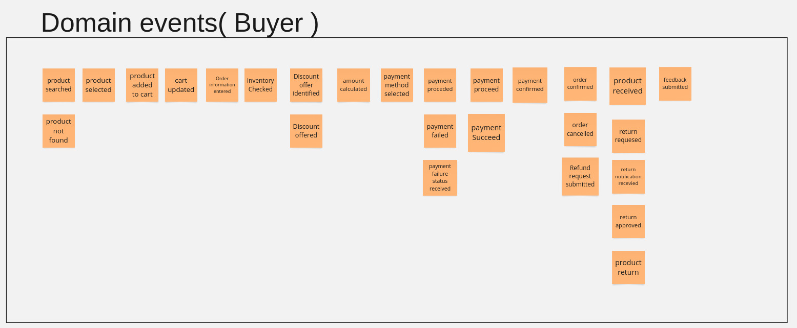
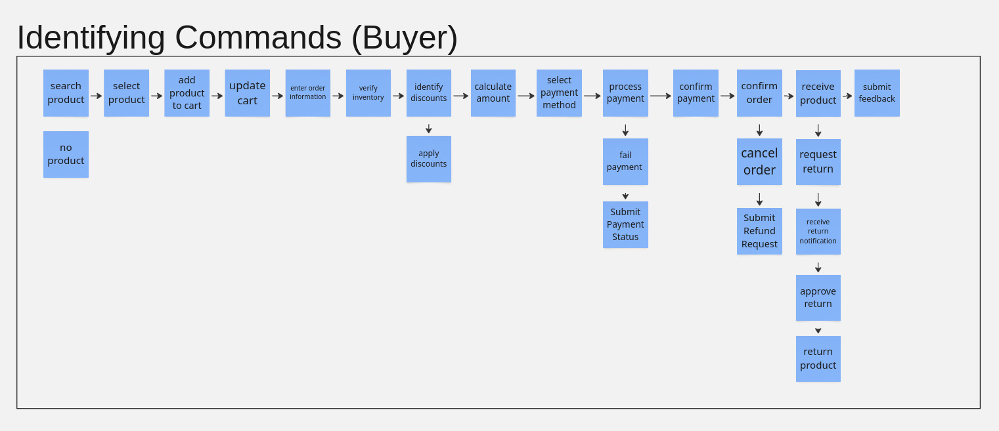
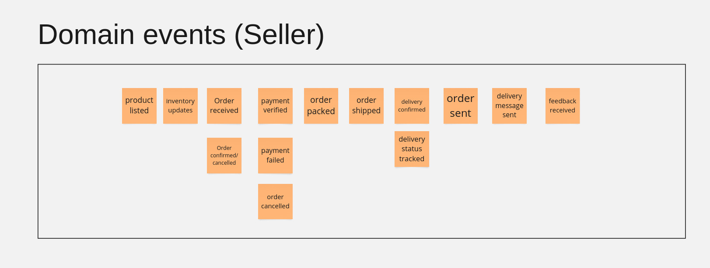
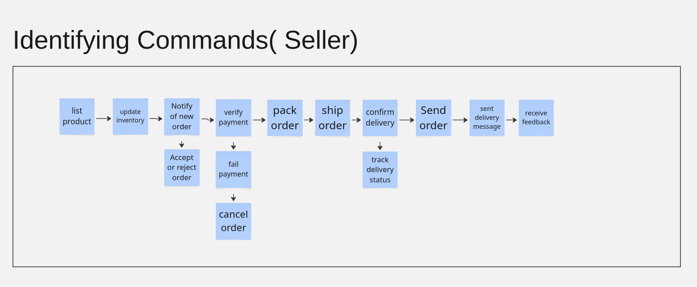
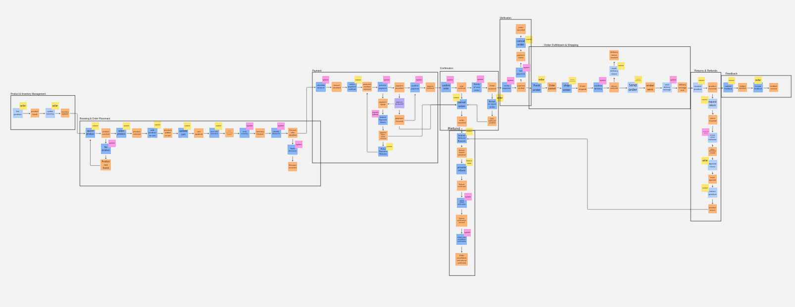

# Event Storming for Marketplace Application

## Doment event for the buyer

- **Product searched**: The buyer initiates a search for a product.
- **Product not found**: No matching product is available.
- **Product selected**: The buyer selects a product to view in detail.
- **Product added to cart**: The buyer adds a product to the shopping cart.
- **Cart viewed**: The buyer views the contents of the shopping cart.
- **Order information entered**: The buyer enters shipping and billing 
- **Inventory checked**: The system checks the availability of the product.
- **Discount applied**: Applicable discounts are applied to the order.
- **Payment initiated**: The buyer initiates the payment process.
- **Payment successful**: The payment is successfully processed.
- **Payment failed**: The payment process fails.
- **Order confirmed**: The order is confirmed and an order number is generated.
- **Order prepared**: The order is prepared for shipment.
- **Order shipped**: The order is shipped to the buyer.
- **Order delivered**: The order is delivered to the buyer.
- **Order cancellation requested**: The buyer requests to cancel the order.
- **Order cancellation confirmed**: The order cancellation is confirmed.
- **Refund processed**: The refund is processed for the buyer.
- **Return requested**: The buyer requests to return the product.
- **Return approved**: The return request is approved.
- **Product returned**: The product is returned by the buyer.
- **Refund processed**: The refund is processed for the returned product.
- **Feedback submitted**: The buyer submits feedback for the product or service.

## Identified commands for the buyer 

 **Search product**: The buyer searches for a product.
- **No product**: The search does not return any results.
- **Select product**: The buyer selects a product from the search results.
 **Add product to cart**: The buyer adds the selected product to their shopping cart.
- **Update cart**: The cart is modified (e.g., quantity updated, product removed).
- **Enter order information**: The buyer provides details like shipping address and billing information.
 **Verify inventory**: The system checks product availability.
- **Identify discounts**: The system looks for applicable discounts.
- **Apply discounts**: The identified discount is applied to the order.
- **Calculate amount**: The system calculates the final payable amount (including discounts, taxes, and shipping).
- **Select payment method**: The buyer chooses a payment option.
- **Process payment**: The system initiates the payment transaction.
- **Fail payment**: The payment process fails.
- **Submit payment status**: The system updates the payment status (success or failure).
- **Confirm payment**: The system verifies successful payment.
- **Confirm order**: The system confirms the order.
- **Receive product**: The buyer receives the product.
- **Cancel order**: The buyer or system cancels the order.
- **Submit refund request**: The buyer submits a refund request.
- **Request return**: The buyer initiates a product return.
- **Receive return notification**: The system acknowledges the return request.
- **Approve return**: The return request is approved.
- **Return product**: The buyer sends back the product.
- **Submit feedback**: The buyer provides a review or rating for the product or service.

## Domain event for seller

- **Product listed**: The seller adds a product to the online marketplace.
- **Inventory updates**: Stock levels are adjusted based on availability.
- **Order received**: A buyer places an order for the product.
- **Order confirmed & enabled**: The system verifies and confirms the order.
- **Payment verified**: The seller confirms successful payment from the buyer.
- **Payment failed**: The payment transaction was unsuccessful.
- **Order packed**: The seller prepares the product for shipping.
- **Order shipped**: The package is dispatched from the seller’s warehouse.
- **Delivery confirmed**: The shipping carrier updates the delivery status.
- **Delivery status tracked**: The system monitors the package’s movement.
- **Order sent**: The seller officially marks the order as dispatched.
- **Delivery message sent**: The seller sends a notification to the buyer regarding delivery status.
- **Order canceled**: The order is canceled due to payment failure, stock issues, or buyer request.
- **Feedback received**: The seller receives a review or rating from the buyer.

## Identified commands for the seller

- **List Product** – Adding a product to the system for potential buyers to view and purchase.
- **Update Inventory** – Adjusting stock levels to reflect availability.
- **Notify of New Order** – Sending an alert when a new order is placed.
- **Verify Payment** – Checking if the payment has been successfully processed.
- **Accept or Reject Order** – Decision-making process based on payment verification and other conditions.
- **Fail Payment** – Handling scenarios where payment is unsuccessful.
- **Cancel Order** – If the payment fails or the order is rejected, the system cancels the order.
- **Pack Order** – Preparing the ordered product for shipping.
- **Ship Order** – Dispatching the package for delivery.
- **Confirm Delivery** – Acknowledging that the package has reached the customer.
- **Track Delivery Status** – Monitoring the delivery process.
- **Send Order** – Sending the order to the customer.
- **Send Delivery Message** – Notifying the customer about the delivery status.
- **Receive Feedback** – Collecting reviews or feedback from the customer about the product or service.

## Grouping together both events

## The link below is the link for miro for better image view 

[click here for the Board ](https://miro.com/app/board/uXjVIOD132Q=/?share_link_id=18707758719)
